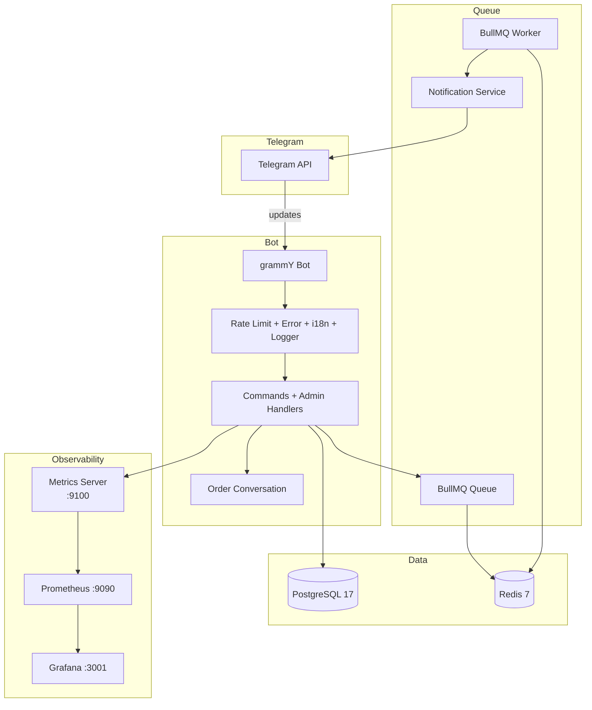

# Telegram CRM Bot

[](https://github.com/hryrhoiiboiko19/telegram-crm-bot/actions/workflows/ci.yml)
[](https://github.com/hryrhoiiboiko19/telegram-crm-bot/actions/workflows/cd.yml)
[](https://codecov.io/github/hryrhoiiboiko19/telegram-crm-bot)

A CRM Telegram bot for service businesses. Handles customer order intake through step-by-step conversations, provides an admin panel for order management, exports data to Google Sheets, and ships with Prometheus metrics, BullMQ background queues, and full Docker + CI/CD pipeline.

## Features

### Customer-facing

- **Step-by-step order intake** — guided conversation collects service type, problem description, and phone number
- **Input validation (Zod)** — strict validation; invalid data triggers a retry prompt instead of polluting the database
- **Multi-language support** — English and Ukrainian locales, auto-selected from the user's Telegram language code
- **Order status notifications** — users receive a Telegram message when their order is confirmed or cancelled (queued via BullMQ)

### Admin panel (`/admin`)

- **View pending orders** — paginated list with inline keyboard buttons
- **Confirm / cancel orders** — one-click status updates with automatic customer notification
- **Business analytics (`/stats`)** — pending/confirmed/completed/cancelled counts, conversion rate, most popular service
- **Broadcast (`/broadcast`)** — send a message to all registered users (rate-limited at 50ms/user to avoid flood wait)
- **Google Sheets export** — one-click export of all orders via Apps Script webhook
- **Admin access control** — restricted to whitelisted Telegram user IDs

### Infrastructure

- **Prometheus metrics** — `prom-client` exposes `/metrics` and `/healthz` on port 9100
- **Queue instrumentation** — BullMQ job counts, processing duration histograms, completed/failed counters
- **Docker Compose** — PostgreSQL, Redis, Prometheus, and Grafana with auto-provisioned datasources
- **CI/CD** — GitHub Actions for lint, typecheck, test+coverage (Codecov), Docker build & push to GHCR
- **Fast-fail env validation** — Zod-validated environment config on startup
- **Rate limiting** — 30 req/60s per user via Redis `INCR`/`EXPIRE`
- **Error boundary** — global `bot.catch` handler logs stack traces and replies a localized error message
- **Webhook & long-polling** — configurable via `WEBHOOK_URL` env var
- **Graceful shutdown** — SIGINT/SIGTERM handlers close all connections cleanly

## Architecture



## Tech Stack

| Layer           | Technology                                           |
| --------------- | ---------------------------------------------------- |
| Bot framework   | [grammY](https://grammy.dev/)                        |
| ORM             | [Drizzle ORM](https://orm.drizzle.team/)             |
| Database        | PostgreSQL 17                                        |
| Cache / Queue   | Redis 7 + [BullMQ](https://docs.bullmq.io/)          |
| Validation      | [Zod](https://zod.dev/)                              |
| Session storage | Redis (`@grammyjs/storage-redis`)                    |
| i18n            | `@grammyjs/i18n` (Fluent)                            |
| Metrics         | [prom-client](https://github.com/siimon/prom-client) |
| Runtime         | Node.js 22 + TypeScript                              |

## Project Structure

```
src/
├── bot/
│   ├── bot.ts                    # Bot setup, middleware chain, routing
│   ├── conversations/            # Step-by-step order conversation
│   ├── handlers/
│   │   ├── admin.ts             # Admin panel, export, stats, broadcast
│   │   ├── admin-orders.ts      # Order view/confirm/cancel/pagination
│   │   ├── admin-keyboard.ts    # Inline keyboard builders
│   │   ├── commands.ts          # /start handler
│   │   └── order.ts             # /order command entry
│   ├── middlewares/
│   │   ├── rateLimit.middleware.ts   # Redis rate limiting (30 req/60s)
│   │   ├── adminGuard.middleware.ts  # Admin-only callback guard
│   │   ├── error.middleware.ts       # Global error boundary
│   │   ├── i18n.middleware.ts        # i18n setup
│   │   └── logger.middleware.ts      # Request logging
│   └── locales/                 # Fluent translation files (en, uk)
├── config/                      # Env (Zod), Redis singleton, Database pool
├── database/
│   ├── schema.ts                # Drizzle table definitions
│   ├── validation.ts            # Zod schemas (UserInsert, OrderInsert)
│   ├── migrations/              # Generated SQL migrations
│   ├── migrate.ts               # Programmatic migrator (prod)
│   └── seed.ts                  # Development seed data
├── metrics/
│   ├── index.ts                 # Prometheus registry + metric definitions
│   ├── queue.ts                 # Queue metrics poller + worker instrumentation
│   └── server.ts                # /metrics + /healthz HTTP server
├── queue/                       # BullMQ queue + worker
├── repositories/                # Data access layer
├── services/                    # Google Sheets export, notifications
├── webhook.ts                   # Webhook mode HTTP server
└── index.ts                     # Bootstrap (polling/webhook, shutdown)
```

## Getting Started

### Prerequisites

- Node.js 22+
- Docker & Docker Compose

### Setup

1. **Install dependencies**

   ```bash
   npm install
   ```

2. **Configure environment**

   ```bash
   cp .env.example .env
   ```

   Fill in your `.env` — see `.env.example` for descriptions of each variable.

3. **Run with Docker (recommended)**

   ```bash
   docker compose up --build
   ```

   This starts PostgreSQL, Redis, the bot, Prometheus, and Grafana together.

4. **Run database migrations**

   For local development:

   ```bash
   npm run db:push    # push schema directly
   # or
   npm run db:generate && npm run db:migrate
   ```

   In production (Docker), migrations run automatically before the bot starts via `npm run db:migrate:prod`.

5. **Local development** (without Docker)
   ```bash
   npm run dev
   ```

### Testing

```bash
npm test                # run all tests
npm run test:coverage   # run tests with coverage report
npm run typecheck       # TypeScript type checking
npm run lint            # ESLint
```

## Bot Commands

| Command                | Who      | Description                                |
| ---------------------- | -------- | ------------------------------------------ |
| `/start`               | Everyone | Registers the user in the database         |
| `/order`               | Everyone | Starts the step-by-step order conversation |
| `/admin`               | Admins   | Opens the admin panel with inline buttons  |
| `/stats`               | Admins   | Shows business analytics report            |
| `/broadcast <message>` | Admins   | Sends a message to all users               |

## Observability

### Metrics (`/metrics`)

The bot exposes Prometheus metrics on `METRICS_PORT` (default 9100):

| Metric                                | Type      | Labels                      |
| ------------------------------------- | --------- | --------------------------- |
| `crm_bot_commands_total`              | Counter   | `command`                   |
| `crm_bot_callbacks_total`             | Counter   | `action`                    |
| `crm_bot_orders_total`                | Counter   | `status`                    |
| `crm_bot_notifications_total`         | Counter   | `result`                    |
| `crm_bot_rate_limit_rejections_total` | Counter   | —                           |
| `crm_bot_errors_total`                | Counter   | `type`                      |
| `crm_http_request_duration_seconds`   | Histogram | `route`, `method`, `status` |
| `crm_queue_jobs_total`                | Counter   | `queue`, `state`            |
| `crm_queue_jobs_processed_total`      | Counter   | `queue`, `result`           |
| `crm_queue_job_duration_seconds`      | Histogram | `queue`                     |

Plus default Node.js and process metrics via `collectDefaultMetrics`.

### Health (`/healthz`)

Returns `200 ok` if both Redis and PostgreSQL are reachable, `500 error` otherwise.

### Grafana

Grafana is available at `http://localhost:3001` with Prometheus auto-provisioned as a datasource. Default credentials: `admin` / `admin`.

## Deployment

### Docker

The Dockerfile is multi-stage and produces a slim production image. The CI/CD pipeline automatically builds and pushes images to GitHub Container Registry (GHCR):

- **On push to `main`**: tagged as `latest` and `sha-<commit>`
- **On version tag `v*.*.*`**: tagged as `v1.2.3`, `v1.2`, and `v1`

Pull and run:

```bash
docker pull ghcr.io/<owner>/telegram-crm-bot:latest
docker run --env-file .env -p 3000:3000 -p 9100:9100 ghcr.io/<owner>/telegram-crm-bot:latest
```

### Webhook mode

Set `WEBHOOK_URL` in `.env` to enable webhook mode. The bot will:

1. Register the webhook with Telegram (`POST /setWebhook`)
2. Start an HTTP server on `PORT` (default 3000)
3. Forward updates from `POST /<WEBHOOK_SECRET>` to `bot.handleUpdate`

Leave `WEBHOOK_URL` empty for long-polling (default).

### Security notes

- **Rotate `BOT_TOKEN` and `REDIS_PASSWORD` regularly.** If `.env` was ever committed, rotate all secrets immediately.
- `WEBHOOK_SECRET` should be a random string — it acts as a URL-based auth token for the webhook endpoint.
- `.env` is in `.gitignore` and `.dockerignore` — it should never be committed.

## Google Sheets Integration

The bot exports orders to a Google Spreadsheet via an Apps Script Web App:

1. Create a Google Spreadsheet with a sheet named **"Orders"**.
2. Open **Extensions \u2192 Apps Script** and paste:

```javascript
function doPost(e) {
  try {
    var payload = JSON.parse(e.postData.contents);
    var rowsToInsert = payload.data;
    var sheet = SpreadsheetApp.getActiveSpreadsheet().getSheetByName("Orders");

    if (rowsToInsert && rowsToInsert.length > 0) {
      for (var i = 0; i < rowsToInsert.length; i++) {
        var currentOrderRow = rowsToInsert[i];
        var finalRowData = [new Date()].concat(currentOrderRow);
        sheet.appendRow(finalRowData);
      }
    }

    return ContentService.createTextOutput(
      JSON.stringify({ status: "success" }),
    ).setMimeType(ContentService.MimeType.JSON);
  } catch (error) {
    return ContentService.createTextOutput(
      JSON.stringify({ status: "error", message: error.toString() }),
    ).setMimeType(ContentService.MimeType.JSON);
  }
}
```

3. **Deploy** as a Web App (`Deploy \u2192 New deployment \u2192 Web app`) with access set to "Anyone".
4. Copy the deployment URL and set it as `GOOGLE_SHEETS_WEBHOOK_URL` in your `.env`.

> Each exported row is written as: `Timestamp | Order ID | User ID | Service Type | Description | Status`

## AI Development Disclosure

This project was developed using **LLM-assisted coding** \u2014 a combination of architectural planning, code generation, refactoring, automated bug-fixing, test writing, and CI/CD pipeline creation via [opencode](https://opencode.ai). All generated code was reviewed and tested by the developer.

## License

MIT
